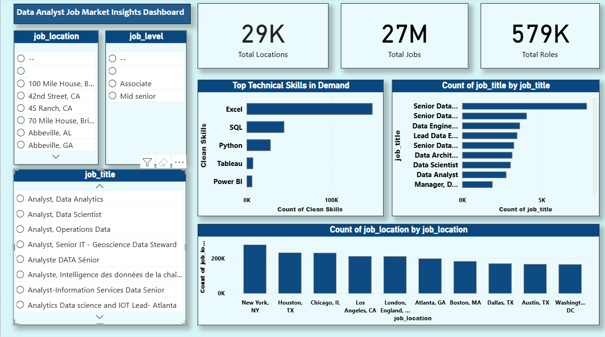

# Job Market Skill Demand Analytics

## Project Overview

The Job Market Skill Demand Analytics project analyzes job postings data to identify the most in-demand skills, job roles, and hiring trends. The project involves data cleaning, analysis, and visualization using Python and Power BI to generate insights about the job market.

This project helps understand which technical skills are most required by companies and how job demand varies across roles and trends.

---

## Objectives

* Analyze job postings dataset
* Identify most in-demand technical skills
* Analyze job roles and hiring trends
* Perform data cleaning and preprocessing
* Create data visualizations
* Build an interactive Power BI dashboard

---

## Tools & Technologies Used

* Python
* Pandas
* NumPy
* Matplotlib
* Seaborn
* Excel
* Power BI
* Jupyter Notebook
* Git & GitHub

---

## Dataset

The dataset contains job postings data including:

* Job titles
* Required skills
* Job descriptions
* Company information
* Job locations

Note: Dataset files are large, so they are not uploaded to GitHub.

---

## Project Workflow

1. Data Collection
2. Data Cleaning
3. Data Preprocessing
4. Skill Extraction
5. Data Analysis
6. Data Visualization
7. Dashboard Creation in Power BI

---

## Dashboard Preview

(Add screenshots in images folder)




---

## Key Insights

* Python and SQL are among the most in-demand skills
* Data Analyst and Data Scientist roles have high demand
* Job demand varies based on location and experience
* Some skills frequently appear together in job postings
* Companies prefer candidates with multiple technical skills

---

## Project Structure

```
job-market-skill-demand-analytics
│
├── notebooks/
│   └── test.ipynb
├── images/
│   ├── dashboard.png
│   └── job_trends.png
├── data/
├── dashboard/
├── README.md
└── .gitignore
```

---

## How to Run the Project

1. Download the dataset
2. Open Jupyter Notebook
3. Run the notebook file
4. View analysis and visualizations
5. Open Power BI dashboard file for interactive dashboard

---

## Future Improvements

* Add more datasets
* Perform salary analysis
* Build machine learning model for job prediction
* Deploy dashboard using web app

---

## Author

**Mansi Raut**
Data Analyst | Python | SQL | Power BI | Machine Learning

---

## GitHub Repository

Project Link:
https://github.com/MansiRaut45/job-market-skill-demand-analytics
